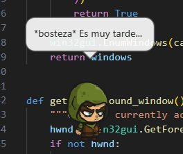
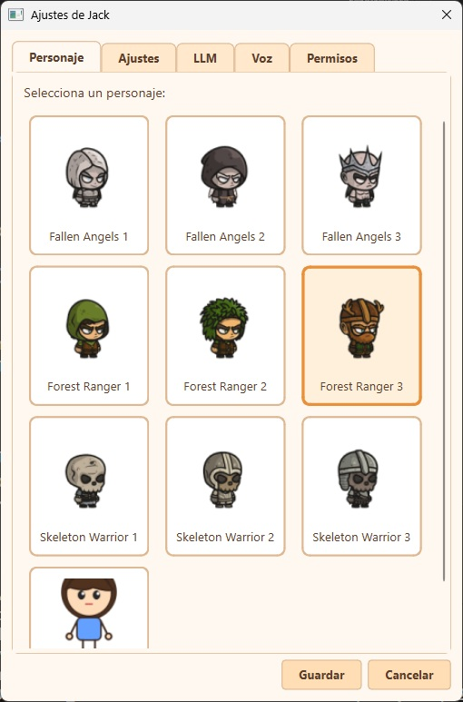

# Jacky — Desktop Virtual Pet

A Windows desktop pet application. Jacky is a cute chibi character who walks around your screen, interacts with windows, interacts with other Jackys, listens to your voice, talks back to you, can *see* your screen, and follows simple instructions.

## Try it now!

[⬇ Download](https://github.com/ikarius6/jacky/releases/latest)

## [Demo](https://github.com/ikarius6/jacky/demo.mp4)

https://github.com/user-attachments/assets/e34f4733-f044-4b01-8944-50e9c8e887cf

## Screenshots





## Features

- **Transparent frameless window** — only the pet sprite is visible
- **Autonomous walking** — Jacky walks along the screen bottom and window title bars
- **Click interactions** — left-click to pet, right-click for context menu, drag to reposition
- **Voice interaction (STT & TTS)** — press a hotkey  to speak to Jacky, and hear spoken responses
- **Screen interaction** — Jacky can follow simple instructions to click on things on your screen
- **Speech bubbles** — contextual dialogue with predefined lines
- **Window awareness** — detects open windows, reads titles, pushes windows, peeks from edges
- **Vision** — Jacky can capture and analyze what's on your screen using multimodal LLM models (DPI-aware, multi-monitor)
- **LLM integration** — three provider options: **Ollama** (local), **Groq** (cloud, with key rotation), and **OpenRouter** (cloud)
- **Multi-instance / Peer interactions** — run multiple Jackys that discover each other and interact (greet, attack, chase, dance, fight)
- **Multilanguage (i18n)** — ships with Spanish and English; add a new language by dropping a single JSON file in `locales/`
- **Granular permissions** — toggle individual behaviours (comment, peek, sit, push, shake, minimize, resize, knock, drag, tidy, topple, vision)
- **System tray** — quick access to settings and quit

## Setup

```bash
# Create and activate virtual environment
python -m venv venv
.\venv\Scripts\activate

# Install dependencies
pip install -r requirements.txt

# Create your config from the example
copy config.json.example config.json

# Run
python main.py
```

## Configuration

Edit `config.json` or use the in-app Settings dialog (right-click Jacky → Settings / Ajustes).

> **Note:** Use `config.json.example` as template.

| Key | Description | Default |
|-----|-------------|---------|
| `language` | UI and dialogue language (`"es"`, `"en"`, …) | `"es"` |
| `movement_speed` | Walking speed (1–10) | `6` |
| `llm_enabled` | Enable LLM dialogue | `false` |
| `llm_provider` | `"ollama"`, `"groq"`, or `"openrouter"` | `"ollama"` |
| `ollama_url` | Ollama server URL | `http://localhost:11434` |
| `ollama_model` | Ollama model name | `llama3.2:latest` |
| `groq_api_keys` | List of Groq API keys (rotation) | `[]` |
| `groq_model` | Groq model identifier | `meta-llama/llama-4-scout-17b-16e-instruct` |
| `openrouter_api_key` | OpenRouter API key | *(empty)* |
| `openrouter_model` | OpenRouter model identifier | `google/gemma-4-26b-a4b-it:free` |
| `window_interaction_enabled` | Enable window awareness | `true` |
| `window_push_enabled` | Allow pushing windows | `true` |
| `bubble_timeout` | Speech bubble duration (seconds) | `5` |
| `peer_interaction_enabled` | Enable multi-instance discovery | `true` |
| `max_peer_instances` | Max simultaneous Jacky instances (1–20) | `5` |
| `peer_check_interval` | Peer poll interval `[min, max]` seconds | `[8, 20]` |
| `permissions` | Object toggling individual behaviours | *(all true)* |

### LLM Providers

- **Ollama** — Run a local model. Install [Ollama](https://ollama.com), pull a model, and set `ollama_url` / `ollama_model`. Supports vision when using a multimodal model.
- **Groq** — Fast cloud inference. Get API keys at [console.groq.com](https://console.groq.com). Supply one or more keys in `groq_api_keys`; Jacky rotates through them automatically and handles rate-limit cooldowns (round-robin with per-key 60 s cooldown).
- **OpenRouter** — Access hundreds of models (some free). Get an API key at [openrouter.ai](https://openrouter.ai), set `llm_provider` to `"openrouter"`, and paste your key in `openrouter_api_key`.

All three providers support **vision** (multimodal image input) with automatic text-only fallback if the selected model doesn't support it.

### Vision

When LLM is enabled, Jacky can "look" at your screen:
- Triggered automatically by keywords in conversation (e.g. "qué ves", "what do you see")
- Triggered manually via the context menu
- Captures a 1024×1024 area around the pet, DPI-aware and multi-monitor safe
- The screenshot is sent to the LLM as a base64 image for analysis

### Screen Interaction

When instructed, Jacky can take action on your screen! Tell Jacky to _"click on the start button"_, or _"close the browser window"_. Jacky will intelligently partition the screen, use vision to identify the target, and perform actual mouse clicks.

Supported actions: **navigate** (walk to), **click**, **write** (type text), **close** (Alt+F4), and **minimize**.

The full pipeline involves intent detection (keyword matching + LLM fallback), a two-phase grid-based locate system with dynamic crop sizing, coordinate mapping across DPI-aware coordinate spaces, and optional LLM-based position refinement.

📖 **[Screen Interaction — Technical Deep Dive](docs/screen_interaction.md)** — full architecture, coordinate pipeline, debug mode, and configuration reference.

### Voice Interaction (STT & TTS)

Jacky can listen to your voice and talk back!
- Enable voice transcription via AssemblyAI. Press `Ctrl+Alt+Space` to toggle voice recording.
- Enable voice synthesis via ElevenLabs. Jacky's responses will be spoken aloud!
- Configure API keys, models, and voices directly in the Settings dialog (Voice tab).

### Multi-instance & Peer Interactions

Run several Jacky instances simultaneously. They discover each other via a shared temp file (`%TEMP%/jacky_peers.json`) and can interact:
- **Greet** — wave and say hello
- **Attack / Fight** — animated battle sequences
- **Chase** — one Jacky chases another
- **Dance** — synchronised dance

Peers appear in a dynamic "Companions" submenu in the context menu.

### Multilanguage (i18n)

Jacky ships with **Spanish** (default) and **English**. The language can be changed live from Settings without restarting.

To add a new language, create a `locales/<code>.json` file following the structure of `locales/es.json`. It will be auto-discovered on next launch.

Translated content includes: dialogues, app-group keywords, UI labels, permission descriptions, vision keywords, and the LLM system prompt.

## Custom Sprites

Drop sprite folders inside `sprites/`. Each folder contains a `character.json` descriptor and sub-folders for each animation state (Idle, Walking, Dying, Hurt, etc.). Sprites should have transparent backgrounds.

## Compile

```powershell
# From project root:
.\venv\Scripts\pyinstaller.exe jacky.spec --noconfirm

# Then copy your config next to the exe (for user-writable settings):
Copy-Item config.json dist\Jacky\config.json
```

Run `dist\Jacky\Jacky.exe` to start Jacky.
